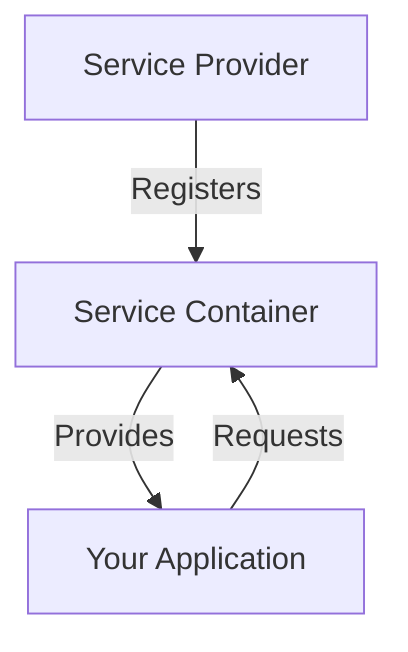

## Service Container and Service Provider
# Understanding the Difference Between Service Container and Service Provider in Laravel

Let me clarify these two core Laravel concepts with simple explanations and examples.

## Service Container: The Dependency Manager

**What it is**:
- Think of it as a **"smart storage box"** for your application's classes and services
- It knows how to create and manage object instances
- Handles dependency injection automatically

**Key responsibilities**:
1. Stores class definitions ("bindings")
2. Creates objects when needed
3. Injects dependencies automatically

**Simple example**:
```php
// Binding an interface to implementation
app()->bind(LoggerInterface::class, FileLogger::class);

// Resolving an instance
$logger = app(LoggerInterface::class); // Returns FileLogger instance
```

## Service Provider: The Setup Crew

**What it is**:
- Think of it as the **"installation team"** that sets up services for the container
- It's where you register your bindings and configurations
- Runs when your application boots up

**Key responsibilities**:
1. Register bindings with the container
2. Perform service initialization
3. Configure packages and components

**Simple example**:
```php
class AppServiceProvider extends ServiceProvider
{
    public function register()
    {
        // Register a binding with the container
        $this->app->bind(LoggerInterface::class, FileLogger::class);
    }

    public function boot()
    {
        // Initialize something after all registrations are done
        View::share('version', '1.0');
    }
}
```

## How They Work Together

1. **Service Provider** registers bindings with the **Service Container**
2. **Service Container** holds these definitions
3. When your app needs a class, the **Container** provides it based on the **Provider's** instructions



## Practical Comparison

| Feature               | Service Container                     | Service Provider                     |
|-----------------------|---------------------------------------|--------------------------------------|
| **Main Purpose**      | Dependency management and injection   | Application and service registration |
| **What it holds**     | Class/interface bindings              | Registration logic                   |
| **When it works**     | Throughout application execution      | During application bootstrapping     |
| **Primary Methods**   | bind(), singleton(), make(), etc.     | register(), boot()                   |
| **Analogy**          | Smart object factory                  | Installation technician              |

## Real-World Example

Imagine building a pizza restaurant:

1. **Service Container** is like:
   - The kitchen's ingredient storage
   - Knows how to make each pizza (Margherita, Pepperoni)
   - Delivers the right pizza when ordered

2. **Service Provider** is like:
   - The manager who sets up the kitchen
   - Defines what ingredients go where
   - Creates the menu (what pizzas can be made)

## When to Use Each

**Use the Service Container when**:
- You need to resolve dependencies in controllers, middleware, etc.
- You want to swap implementations
- You need dependency injection

**Use a Service Provider when**:
- You need to register new services
- You're setting up package configurations
- You need to run initialization code

## Common Mistakes

1. **Putting business logic in providers** (they should only set up services)
2. **Registering heavy services in register()** (should be in boot())
3. **Forgetting to register the provider** in config/app.php

## Practical Code Flow

1. A provider registers a binding:
```php
// AppServiceProvider.php
public function register()
{
    $this->app->bind(PaymentGateway::class, StripeGateway::class);
}
```

2. The container stores this binding

3. Your controller requests the service:
```php
public function checkout(PaymentGateway $gateway) 
{
    // Container automatically provides StripeGateway
    $gateway->charge(100);
}
```

Remember: Providers set up the container, and the container provides the services when needed. They work together to make Laravel's dependency injection system powerful and flexible.